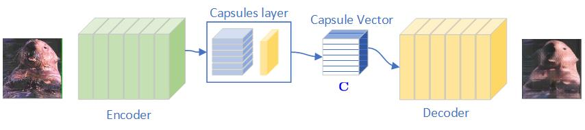
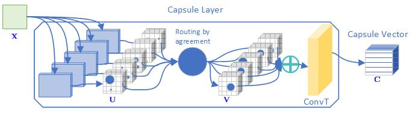
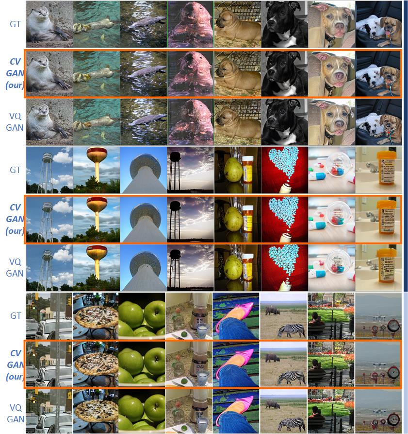

# CV_GAN
Image Generation with Capsule Vector-VAE 
This repository implement the work presented in: [CVGAN: Image Generation with Capsule Vector-VAE](https://link.springer.com/chapter/10.1007/978-3-031-06427-2_45) 
We propose <b>Capsule Vector - VAE(CV-VAE)</b>, a new model based on VQ-VAE architecture where the <em>discrete bottleneck</em> represented by the quantization code-book
is replaced with a capsules layer. 
We demonstrate that the capsules can be successfully applied for the clusterization procedure reintroducing the differentiability of the bottleneck in the model. 
 
The capsule layer clusters the encoder outputs considering the agreement among capsules. 
 
The CV-VAE is trained within Generative Adversarial Paradigm (GAN), CVGAN in short. Our model is shown to perform on par with the original VQGAN, VAE in GAN. 
CVGAN obtains images with higher quality after few epochs of training. The interpretability of the training process for the latent representation is significantly increased maintaining the structured bottleneck idea.  
 
This has practical benefits, for instance, in unsupervised representation learning, where a large number of capsules may lead to the disentanglement of latent representations 
 
We present results on ImageNet, COCOStuff, and FFHQ datasets, and we compared the obtained images with results with VQGAN. 

This repository is based on the [Taming Transformers for High-Resolution Image Synthesis](https://compvis.github.io/taming-transformers/)
How to make it work:
1) Download and install the repository (https://compvis.github.io/taming-transformers/)
2) Substitute the original files with the files in this repository 
3) The model is going to be trained on ImageNet. If you want to use another dataset follow the Data Preparation istruction in taming transformers repository.
5) python main.py --base configs/imagenet_vcgan.yaml -t True --gpus 0

if you need the trained model send an issue to the me 👩‍🦱 (the project was developed at [@machine-learning-and-perception-lab](https://machinelearning.uniud.it/))

if you use our work: please cite us in your publications:
@inproceedings{pucci2022cvgan,
  title={CVGAN: Image Generation with Capsule Vector-VAE},
  author={Pucci, Rita and Micheloni, Christian and Foresti, Gian Luca and Martinel, Niki},
  booktitle={International Conference on Image Analysis and Processing},
  pages={536--547},
  year={2022},
  organization={Springer}
}
